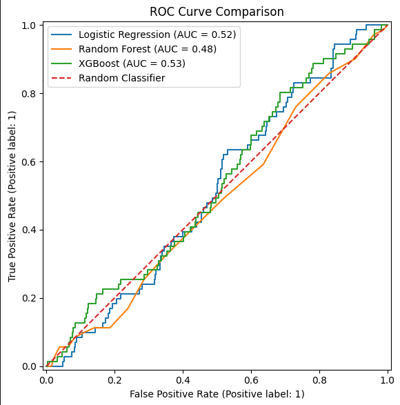
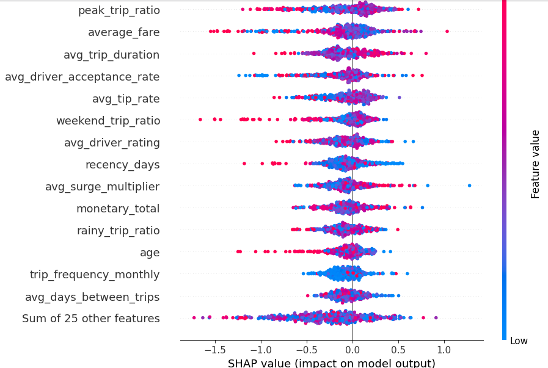
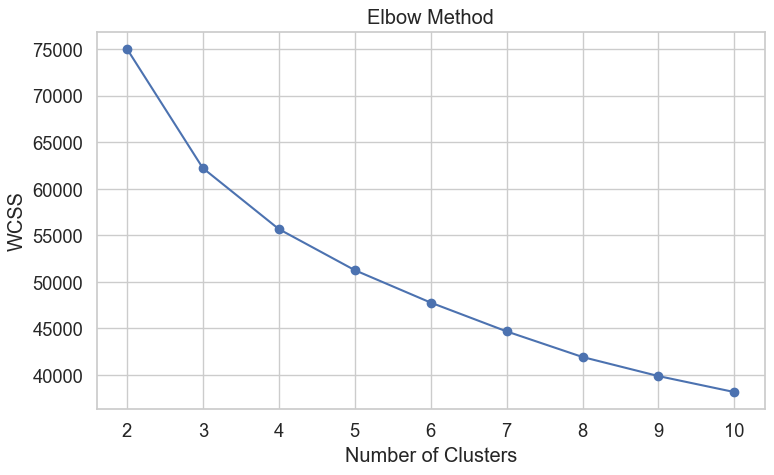
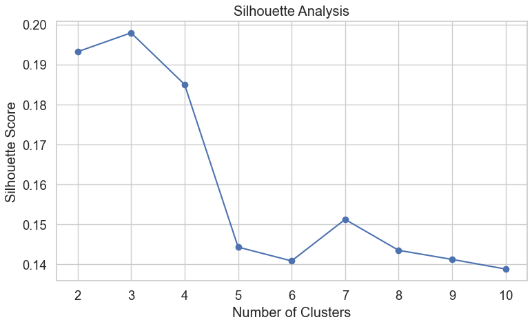
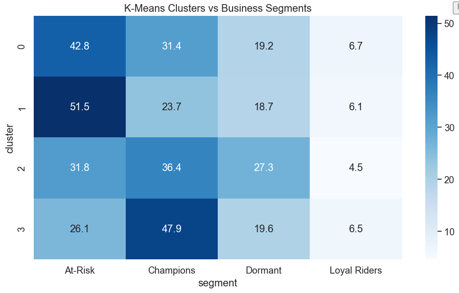

# 🚀 RideWise London
## Customer Intelligence: Churn Prediction & Customer Segmentation


RideWise London is an end-to-end machine learning project that investigates customer behaviour within a fictional ride-hailing platform.

The project combines supervised and unsupervised machine learning techniques to analyse rider behaviour, predict customer churn, identify meaningful customer segments, and generate business recommendations for improving customer retention.

Unlike many portfolio projects that focus only on achieving high model performance, this project follows an evidence-based approach by evaluating whether historical behavioural data contains sufficient predictive signal for future churn. The project also demonstrates how unsupervised learning can provide valuable business insights even when predictive performance is limited.

---

# 📋 Table of Contents

- Overview
- Business Problem
- Project Objectives
- Dataset Description
- Project Workflow
- Project Structure
- Technology Stack
- Data Preprocessing
- Feature Engineering
- Customer Segmentation
- Churn Prediction
- Model Explainability
- Results
- Business Recommendations
- Limitations
- Future Improvements
- Installation
- How to Run
- License

---

---

# 🏢 Business Challenge

RideWise London is a fictional ride-hailing company operating across multiple cities. Like many mobility platforms, the company faces increasing customer acquisition costs and growing competition, making customer retention a strategic priority.

Although RideWise collects large volumes of customer, trip and operational data, the business lacks a structured approach to understanding customer behaviour and identifying riders who may be at risk of leaving the platform.

The company faces several key challenges:

- 📉 Limited visibility into customer behaviour and engagement patterns.
- 🚕 Difficulty identifying riders who are becoming inactive before they stop using the platform.
- 💰 Inefficient marketing campaigns that target broad customer groups rather than high-value or at-risk riders.
- 📊 Limited customer segmentation to support personalised promotions and loyalty programmes.
- 🎯 Lack of data-driven insights to guide customer retention strategies.

To address these challenges, this project develops an end-to-end customer intelligence solution that combines behavioural feature engineering, machine learning and customer segmentation.

The project focuses on answering two key business questions:

1. Can historical rider behaviour be used to predict future customer churn?

2. Can customers be grouped into meaningful behavioural segments that support targeted retention and marketing strategies?
---

# 🎯 Project Objectives

The objectives of this project are to:

- Build a complete end-to-end machine learning workflow.
- Clean and prepare raw customer and trip datasets.
- Engineer behavioural and temporal customer features.
- Develop machine learning models to predict customer churn.
- Compare multiple classification algorithms.
- Explain model behaviour using feature importance and SHAP.
- Discover natural customer groups using K-Means clustering.
- Evaluate cluster quality using the Elbow Method and Silhouette Score.
- Translate analytical findings into actionable business recommendations.

---

# 📊 Dataset Description

The project uses a synthetic ride-hailing dataset consisting of multiple related tables.

| Dataset | Description |
|---------|-------------|
| Riders | Customer demographic and account information |
| Trips | Historical trip transactions and fare information |
| Drivers | Driver ratings and operational information |
| Sessions | Customer application usage data |
| Promotions | Marketing campaign information |

The target variable was created using a temporal prediction approach rather than relying on a predefined churn label.

Historical customer behaviour was used to determine whether a rider remained active during a future prediction window.

---

# 🔄 Project Workflow

The project follows a structured machine learning workflow:

1. Data Preprocessing
2. Feature Engineering
3. Customer Churn Prediction
4. Model Explainability
5. Customer Segmentation using K-Means
6. Business Recommendations

This workflow reflects a real-world data science pipeline from raw data to business insights.

---

# 🏆 Key Features

✅ End-to-end machine learning workflow

✅ Leakage-free temporal feature engineering

✅ Customer churn prediction using multiple machine learning models

✅ Feature importance and SHAP explainability

✅ K-Means customer segmentation

✅ Elbow Method for selecting the optimal number of clusters

✅ Silhouette Score for cluster validation

✅ Business-focused customer profiling

✅ Actionable customer retention recommendations

---

# 📁 Project Structure

```text
RideWise_London/
│
├── data/
│   ├── raw/
│   │   ├── riders.csv
│   │   ├── trips.csv
│   │   ├── drivers.csv
│   │   ├── sessions.csv
│   │   └── promotions.csv
│   │
│   └── processed/
│       ├── riders_clean.csv
│       ├── trips_clean.csv
│       ├── drivers_clean.csv
│       ├── sessions_clean.csv
│       ├── features.csv
│       └── segment_assignment.csv
│
├── models/
│   └── ridewise_xgboost_diagnostic_pipeline.pkl
│
├── notebooks/
│   ├── 01_preprocessing.ipynb
│   ├── 02_feature_engineering.ipynb
│   ├── 03_churn_prediction.ipynb
│   ├── 04_explainability.ipynb
│   └── 05_customer_segmentation_and_clustering.ipynb
│
├── reports/
│   └── figures/
│
├── README.md
├── requirements.txt
├── .gitignore
└── LICENSE
```

The project follows a structured machine learning workflow, progressing from raw data preprocessing through feature engineering, predictive modelling, explainability and customer segmentation.

Each notebook focuses on a single stage of the workflow, making the project easy to understand, reproduce and extend.

---

# 🛠️ Technology Stack

| Category | Technologies |
|-----------|--------------|
| Programming | Python 3.12 |
| Data Processing | pandas, NumPy |
| Data Visualisation | Matplotlib, Seaborn |
| Machine Learning | scikit-learn |
| Explainable AI | SHAP |
| Clustering | K-Means, Elbow Method, Silhouette Score |
| Model Persistence | Joblib |
| Development Environment | Jupyter Notebook, VS Code |
| Version Control | Git, GitHub |

---

# ⚙️ Machine Learning Workflow

The project follows a reproducible end-to-end machine learning workflow:

```text
Raw Data
    │
    ▼
Data Preprocessing
    │
    ▼
Feature Engineering
    │
    ▼
Customer Segmentation
(K-Means)
    │
    ▼
Churn Prediction
(Logistic Regression, Random Forest, XGBoost)
    │
    ▼
Model Explainability
(SHAP & Feature Importance)
    │
    ▼
Business Insights &
Recommendations
```

This workflow reflects a real-world data science process by combining supervised learning, unsupervised learning and explainable AI to support business decision-making.


---

# 🧹 Data Preprocessing

High-quality data is essential for reliable machine learning models. Before feature engineering and modelling, each dataset underwent a comprehensive preprocessing pipeline to improve data quality and ensure consistency.

The preprocessing stage included:

### Riders

- Standardised column names and text values.
- Removed duplicate records.
- Validated customer ages and account information.
- Created a referral indicator from referral information.
- Corrected inconsistent data types.

### Trips

- Converted date and time fields to datetime format.
- Removed invalid trip records.
- Validated fare amounts and surge multipliers.
- Calculated trip duration.
- Checked geographical coordinates for invalid values.
- Standardised numerical and categorical variables.

### Drivers

- Removed duplicate driver records.
- Validated driver ratings and acceptance rates.
- Checked vehicle information for consistency.

### Sessions

- Converted session timestamps to datetime format.
- Validated session duration and application activity.
- Removed invalid session records.

### Promotions

- Standardised categorical variables.
- Validated promotion dates and campaign information.
- Removed duplicate campaign records.

### Data Quality Checks

The following validation checks were performed across all datasets:

- Missing value assessment
- Duplicate detection
- Invalid numerical values
- Inconsistent categorical values
- Datetime validation
- Data type verification
- Referential integrity between related datasets

These preprocessing steps produced clean, consistent datasets that served as the foundation for feature engineering and machine learning.

---

---

# ⚙️ Feature Engineering

Feature engineering transformed raw customer and trip data into meaningful behavioural variables that better represent customer activity and purchasing patterns.

A temporal modelling approach was used to prevent data leakage by ensuring that only information available before the prediction window was used to generate features.

## Target Variable

Rather than relying on a predefined churn label, a new target variable was created using a temporal prediction framework.

The dataset was divided into:

- **Observation Window:** Historical customer behaviour used for feature engineering.
- **Prediction Window:** The following 60-day period used to determine whether a customer remained active.

A customer was labelled as:

- **Churned (1):** No trips during the prediction window.
- **Active (0):** At least one trip during the prediction window.

This approach better reflects how churn prediction is performed in real-world business environments.

---

## Customer Features

Customer-level attributes were created to describe rider characteristics and account history, including:

- Account age
- Account age in months
- Referral status
- Loyalty status
- Customer demographics

These features provide context about customer maturity and long-term engagement.

---

## RFM Features

Recency, Frequency and Monetary (RFM) metrics were generated to summarise customer purchasing behaviour.

### Recency

Measures how recently a customer completed a trip.

Examples:

- Days since last trip
- Average days between trips

### Frequency

Measures how often a customer uses the platform.

Examples:

- Total trips
- Trips in the last 30 days
- Trips in the last 60 days
- Trips in the last 90 days
- Monthly trip frequency

### Monetary

Measures customer spending behaviour.

Examples:

- Total spend
- Average fare
- Average spend per trip
- Customer lifetime value

---

## Behavioural Features

Additional behavioural features were engineered to better capture customer usage patterns.

Examples include:

- Average trip duration
- Average surge multiplier
- Average tip
- Average tip rate
- Peak-hour trip ratio
- Weekend trip ratio
- Rainy-day trip ratio

These features help describe how customers interact with the RideWise platform beyond simple trip counts.

---

## Driver Interaction Features

Driver-related features were aggregated to reflect the quality of customer-driver interactions.

Examples include:

- Average driver rating
- Average driver acceptance rate
- Preferred vehicle type

These variables provide additional behavioural context that may influence customer satisfaction and retention.

---

## Session Features

The sessions dataset was evaluated for potential engagement features.

However, exploratory analysis showed that session records covered only a limited time period and contained insufficient historical information for reliable feature engineering.

To avoid introducing large numbers of missing values and unreliable predictors, session-derived features were excluded from the final modelling dataset.

---

## Final Feature Set

The final modelling dataset combined customer, behavioural, temporal and RFM features into a single feature table suitable for both supervised and unsupervised machine learning.

The dataset was validated to ensure:

- No duplicate customers
- Consistent data types
- No missing target values
- Leakage-free feature generation
- Features derived exclusively from historical information

This feature engineering pipeline produced a robust dataset for customer segmentation, churn prediction and explainable machine learning.

---

# 🎯 Customer Segmentation

Customer segmentation was performed using **K-Means Clustering** to identify groups of riders with similar behavioural patterns.

Unlike churn prediction, which attempts to predict future customer behaviour, clustering is an unsupervised learning technique that discovers natural groupings within the data without using the target variable.

---

## Clustering Features

The clustering model was built using behavioural variables that describe customer activity and value.

The selected features included:

- Recency
- Frequency
- Monetary Value
- Monthly Trip Frequency
- Customer Lifetime Value
- Trips in the Last 30 Days
- Average Days Between Trips
- Average Trip Duration
- Average Tip Rate
- Account Age

These features provide a comprehensive view of customer engagement and purchasing behaviour.

---

## Feature Scaling

Because K-Means is a distance-based algorithm, all numerical variables were standardised using **StandardScaler** before clustering.

Standardisation ensures that variables measured on different scales contribute equally to the clustering process.

---

## Selecting the Optimal Number of Clusters

Two complementary techniques were used to determine the appropriate number of customer segments.

### Elbow Method

The Elbow Method evaluates the Within-Cluster Sum of Squares (WCSS) across different numbers of clusters.

The optimal number of clusters is identified where additional clusters provide diminishing improvements in model fit.

### Silhouette Score

The Silhouette Score measures how well observations fit within their assigned cluster compared with neighbouring clusters.

Higher silhouette scores indicate better cluster separation and more cohesive customer groups.

The combined results from the Elbow Method and Silhouette analysis supported the final choice of **four customer clusters**.

---

## Customer Profiles

The clustering algorithm identified four distinct behavioural groups.

| Customer Segment | Characteristics | Business Strategy |
|------------------|-----------------|-------------------|
| Champions | High spending, frequent trips, recent activity | Reward loyalty and maintain engagement |
| Regular Riders | Moderate usage and spending | Increase engagement through personalised promotions |
| Dormant Riders | Low recent activity and long periods of inactivity | Target with reactivation campaigns and incentives |
| VIP Riders | Small group of exceptionally valuable customers with no observed churn | Provide premium services and exclusive rewards |

---

## Comparing K-Means with Business Segmentation

The data-driven K-Means clusters were compared with the existing business-defined customer segments.

Although there was partial agreement between both approaches, the comparison showed that unsupervised learning identified behavioural patterns that were not fully captured by the rule-based segmentation.

This demonstrates how machine learning can complement traditional business segmentation by uncovering previously unseen customer groups.

---

## Business Value

The customer segmentation analysis provides several practical benefits:

- Enables targeted marketing campaigns.
- Supports personalised customer engagement.
- Identifies high-value customers for loyalty programmes.
- Highlights inactive customers for reactivation campaigns.
- Improves allocation of marketing resources through behaviour-based targeting.

While the churn prediction models demonstrated limited predictive performance on this dataset, customer segmentation generated meaningful business insights that can directly support customer retention strategies.

---

# 🤖 Churn Prediction

Customer churn prediction was formulated as a binary classification problem, where the objective was to identify riders who would become inactive during a future prediction window based on their historical behaviour.

A leakage-free temporal approach was adopted to ensure that only information available before the prediction period was used for modelling.

---

## Train-Test Split

The modelling dataset was divided into training and testing sets using a stratified train-test split to preserve the class distribution.

This approach allows model performance to be evaluated on previously unseen data, providing a more realistic assessment of predictive performance.

---

## Data Preprocessing Pipeline

To ensure a reproducible workflow and prevent data leakage, all preprocessing steps were incorporated into a Scikit-learn Pipeline.

### Numerical Features

- Median imputation for missing values
- Standardisation using StandardScaler

### Categorical Features

- Most frequent value imputation
- One-Hot Encoding

Embedding preprocessing within the pipeline ensures that transformations learned from the training data are consistently applied to unseen data.

---

## Machine Learning Models

Three classification models were evaluated.

### Logistic Regression

Logistic Regression was used as the baseline model due to its simplicity, interpretability and widespread use in customer analytics.

### Random Forest

Random Forest was evaluated to capture potential non-linear relationships and interactions between behavioural features.

### XGBoost

XGBoost was included as an advanced gradient boosting algorithm capable of modelling more complex customer behaviour.

---

## Model Evaluation

Models were evaluated using multiple classification metrics.

| Metric | Purpose |
|---------|---------|
| Accuracy | Overall prediction performance |
| Precision | Reliability of predicted churners |
| Recall | Ability to identify actual churners |
| F1 Score | Balance between Precision and Recall |
| ROC-AUC | Overall ability to distinguish churners from active customers |
| Average Precision | Performance on the minority class |

ROC curves, Precision-Recall curves and confusion matrices were also generated to compare model performance visually.

---

## Model Findings

Although multiple machine learning algorithms were evaluated, all models achieved similar predictive performance.

Further investigation showed that customers who eventually churned exhibited behavioural patterns that were very similar to customers who remained active.

Comparison of key behavioural variables—including recency, trip frequency and spending—revealed only small differences between the two groups.

As a result, the available historical features contained limited predictive signal for future churn.

Rather than forcing additional feature engineering or excessive model tuning, the project adopted an evidence-based conclusion that the current synthetic dataset is not sufficiently informative for reliable individual churn prediction.

---

## Business Interpretation

The modelling process demonstrated that strong machine learning algorithms cannot compensate for weak predictive signal within the underlying data.

This finding is itself valuable from a business perspective, as it highlights the importance of collecting richer behavioural information before deploying predictive retention models.

Rather than relying solely on churn prediction, organisations can combine predictive modelling with customer segmentation to support more targeted customer engagement strategies.

This balanced approach reflects real-world data science practice, where understanding model limitations is just as important as achieving strong predictive performance.

---

# 🔍 Model Explainability

Understanding why a machine learning model makes a prediction is just as important as the prediction itself.

To improve model transparency and interpretability, explainability techniques were applied to investigate how different behavioural features influenced churn predictions.

---

## Feature Importance

Feature importance was used to identify the variables that contributed most to the model's predictions.

This analysis provides a high-level understanding of which behavioural characteristics were most influential during model training.

Examples of important features included:

- Recency (Days Since Last Trip)
- Trip Frequency
- Customer Lifetime Value
- Monthly Trip Frequency
- Monetary Value
- Average Days Between Trips

These variables represent key aspects of customer engagement and purchasing behaviour.

---

## SHAP (SHapley Additive exPlanations)

SHAP values were used to explain individual predictions and quantify the contribution of each feature.

Unlike traditional feature importance, SHAP provides both global and local explanations.

### Global Explainability

Global SHAP analysis was used to:

- Rank the overall importance of features.
- Understand how each variable influenced predictions across the entire dataset.
- Identify consistent behavioural patterns learned by the model.

### Local Explainability

Local SHAP explanations were generated for individual customers to illustrate how specific behavioural characteristics influenced predicted churn risk.

This enables analysts and business stakeholders to understand the reasoning behind individual predictions rather than treating the model as a black box.

---

## Permutation Importance

Permutation Importance was used as an additional validation technique.

Each feature was randomly shuffled while measuring the impact on model performance.

Features that produced a larger decrease in predictive performance were considered more influential.

This approach provides a model-agnostic assessment of feature importance and complements SHAP analysis.

---

## Explainability Findings

The explainability analysis showed that the model relied primarily on behavioural features related to customer activity and spending.

However, feature importance values were generally modest, reflecting the limited separation between churned and active customers observed during model evaluation.

These findings were consistent with the overall modelling results and reinforced the conclusion that the available historical data contained limited predictive information for future churn.

---

## Business Value

Model explainability improves confidence in machine learning by making predictions transparent and interpretable.

Rather than providing only a churn probability, explainability enables business stakeholders to understand the behavioural factors influencing customer risk.

This supports more informed decision-making and helps ensure that predictive models are used responsibly within customer retention strategies.

---

# 📊 Key Results

The project evaluated both supervised and unsupervised machine learning techniques to understand customer behaviour and support retention strategies.

## Customer Segmentation

The K-Means clustering algorithm successfully identified four distinct behavioural customer groups.

The Elbow Method and Silhouette Score were used to determine the optimal number of clusters before fitting the final model.

The resulting customer segments included:

- Champions
- Regular Riders
- Dormant Riders
- VIP Riders

These segments demonstrated meaningful differences in customer activity, spending behaviour and engagement, providing actionable insights for targeted marketing and customer retention.

---

## Churn Prediction

Three machine learning models were evaluated:

- Logistic Regression
- Random Forest
- XGBoost

Model performance was assessed using:

- Accuracy
- Precision
- Recall
- F1 Score
- ROC-AUC
- Average Precision

Although multiple algorithms were explored, all models produced similar predictive performance.

Further analysis showed that churned and active riders displayed very similar behavioural characteristics across key variables such as recency, frequency and spending.

Consequently, the available historical features contained limited predictive signal for reliable individual churn prediction.

Rather than pursuing unnecessary model complexity, the project adopted an evidence-based conclusion that the synthetic dataset was not sufficiently informative for accurate churn prediction.

---

## Model Explainability

Feature Importance, SHAP and Permutation Importance were used to investigate how behavioural variables influenced model predictions.

The explainability analysis confirmed that customer activity and spending behaviour contributed most to model predictions while also supporting the conclusion that the available features provided only modest predictive information.

---

## Overall Outcome

Although the churn prediction models demonstrated limited predictive performance, the project successfully delivered valuable customer intelligence through behavioural feature engineering, explainable machine learning and customer segmentation.

The combination of supervised and unsupervised learning provides a realistic example of how data science supports business decision-making, even when predictive performance is constrained by the available data.

---

---

# 📈 Project Visualizations

The following visualisations summarise the main findings from the RideWise London customer intelligence project.

They provide a quick overview of the churn prediction results, model explainability and customer segmentation analysis.

---

## Churn Prediction Performance

### ROC Curve

The ROC curve evaluates how well the churn prediction models distinguish between churned and active riders across different classification thresholds.



The models produced similar ROC-AUC results, indicating that the available historical behavioural features contained limited predictive signal for future churn.

---

## Model Explainability

### SHAP Summary Plot

The SHAP summary plot explains how each feature influenced the churn model's predictions.



Features related to rider activity, trip frequency, spending and recency contributed most to the model predictions.

However, the overall SHAP effects were modest, which was consistent with the limited separation observed between churned and active riders.

---

## Customer Segmentation

### Elbow Method

The Elbow Method was used to assess how the within-cluster sum of squares changed as the number of clusters increased.



The point where the improvement began to slow helped identify a reasonable number of customer clusters.

---

### Silhouette Score

The Silhouette Score was used to evaluate how well riders were grouped within their assigned clusters and separated from other clusters.



The combined evidence from the Elbow Method and Silhouette Score supported the final four-cluster solution.

---

### K-Means Cluster Heatmap

The cluster heatmap compares the standardised behavioural characteristics of the customer groups identified by K-Means.



The heatmap supported the interpretation of four distinct customer profiles:

- Champions
- Regular Riders
- Dormant Riders
- VIP Riders

These customer groups demonstrated meaningful differences in recency, frequency, spending, trip behaviour and customer value.

---

## Visualisation Summary

The churn prediction visualisations showed that the available behavioural data had limited ability to reliably separate churned riders from active riders.

In contrast, the customer segmentation visualisations identified meaningful behavioural differences between customer groups.

This supported the project's main conclusion that customer segmentation provided more immediate and actionable business value than individual churn prediction for the available dataset.

# 💼 Business Recommendations

The analysis demonstrates that customer segmentation provides more actionable business value than individual churn prediction for the available dataset.

Based on the findings, the following recommendations are proposed.

## Champions

**Profile**

- High spending
- Frequent trips
- Highly engaged customers
- Low observed churn

**Recommended Actions**

- Introduce premium loyalty rewards.
- Offer referral incentives.
- Provide early access to new platform features.
- Reward long-term customer loyalty.

---

## Regular Riders

**Profile**

- Consistent platform usage
- Moderate spending
- Stable engagement

**Recommended Actions**

- Increase engagement through personalised promotions.
- Encourage higher trip frequency with targeted discounts.
- Recommend subscription or membership programmes.
- Promote cross-selling opportunities.

---

## Dormant Riders

**Profile**

- Low recent activity
- Long periods between trips
- Higher inactivity risk

**Recommended Actions**

- Launch targeted win-back campaigns.
- Send personalised reminders and promotional offers.
- Investigate barriers to continued platform usage.
- Monitor behaviour following reactivation campaigns.

---

## VIP Riders

**Profile**

- Small group of exceptionally valuable customers.
- High spending and frequent platform usage.
- No observed churn during the study period.

**Recommended Actions**

- Deliver personalised customer support.
- Provide exclusive rewards and recognition.
- Offer premium benefits and tailored incentives.
- Maintain long-term customer relationships through proactive engagement.

---

## Strategic Recommendations

Although the predictive models demonstrated limited ability to identify individual churners, the project highlights several opportunities for improving customer retention.

### Short-Term

- Use behavioural customer segmentation to guide marketing campaigns.
- Prioritise customer engagement based on behavioural profiles.
- Develop targeted retention strategies for dormant customers.

### Medium-Term

- Collect richer behavioural data, including longer-term customer engagement information.
- Improve data quality by expanding historical observations.
- Incorporate additional operational and contextual variables into future modelling.

### Long-Term

- Retrain predictive models as more behavioural data become available.
- Monitor customer segments over time to detect behavioural changes.
- Combine predictive modelling with customer segmentation to support data-driven retention strategies.

---

## Business Value

This project demonstrates how machine learning can support customer intelligence beyond prediction alone.

Rather than relying exclusively on predictive accuracy, the combination of behavioural feature engineering, customer segmentation and explainable machine learning provides practical insights that can improve customer engagement, marketing effectiveness and long-term retention strategies.


---

# ⚠️ Project Limitations

Like many real-world machine learning projects, this analysis has several limitations that should be considered when interpreting the results.

## Synthetic Dataset

The project uses a synthetic dataset designed to simulate customer behaviour within a ride-hailing platform.

Although suitable for demonstrating machine learning techniques, synthetic data may not capture the full complexity of real customer behaviour.

---

## Limited Predictive Signal

The behavioural characteristics of churned and active customers were highly similar across the available historical features.

As a result, the machine learning models demonstrated limited ability to distinguish future churners from active riders.

This finding highlights the importance of evaluating data quality before assuming that increasingly complex models will improve predictive performance.

---

## Limited Historical Engagement Data

The session dataset covered only a limited observation period, preventing the creation of reliable long-term engagement features.

Consequently, session-derived variables were excluded from the final modelling dataset.

---

## Generalisability

The findings presented in this project are specific to the available synthetic dataset.

Applying the same modelling approach to production data would require additional validation, feature engineering and continuous model monitoring.

---

# 🚀 Future Improvements

Several enhancements could further strengthen the project if richer data became available.

## Data Improvements

- Collect longer periods of customer behavioural data.
- Include cancellation history and customer support interactions.
- Incorporate customer satisfaction and feedback data.
- Add richer marketing campaign response information.

---

## Feature Engineering

Potential future features include:

- Behavioural trends over time.
- Rolling engagement metrics.
- Seasonal travel behaviour.
- Promotion response history.
- Customer lifetime behavioural trajectories.

---

## Machine Learning

Future modelling improvements could include:

- Time-series feature engineering.
- Survival analysis for customer retention.
- Gradient boosting optimisation.
- Probability calibration.
- Cost-sensitive learning.
- Automated feature selection.

---

## Business Analytics

Future work could include:

- Customer lifetime value prediction.
- Marketing campaign optimisation.
- Promotion response modelling.
- Personalised recommendation systems.
- Dynamic customer segmentation.

---

# 🚀 Installation

## Clone the Repository

```bash
git clone https://github.com/yourusername/RideWise_London.git

cd RideWise_London
```

---

## Create a Virtual Environment

### Windows

```bash
python -m venv venv

venv\Scripts\activate
```

### macOS / Linux

```bash
python3 -m venv venv

source venv/bin/activate
```

---

## Install Dependencies

```bash
pip install --upgrade pip

pip install -r requirements.txt
```

---

# ▶️ Running the Project

Run the notebooks in the following order:

1. 01_preprocessing.ipynb
2. 02_feature_engineering.ipynb
3. 03_churn_prediction.ipynb
4. 04_explainability.ipynb
5. 05_customer_segmentation_and_clustering.ipynb

Each notebook builds on the outputs generated by the previous notebook.

---

# 📜 License

This project is licensed under the MIT License.

---

# 👨‍💻 Author

**Ransom Chukwu**

Medical Doctor | Public Health Professional | Data Scientist

## Areas of Interest

- Machine Learning
- Healthcare Data Science
- Customer Analytics
- Predictive Modelling
- Explainable AI
- Health Informatics

---

⭐ If you found this project interesting, consider starring the repository and connecting with me on LinkedIn.